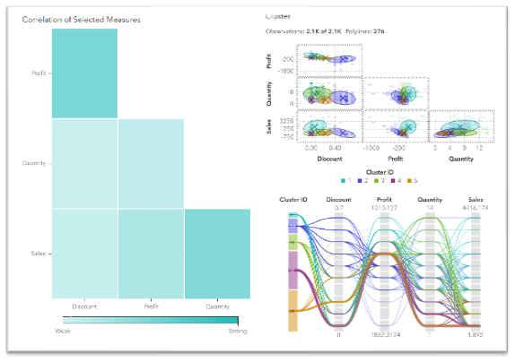
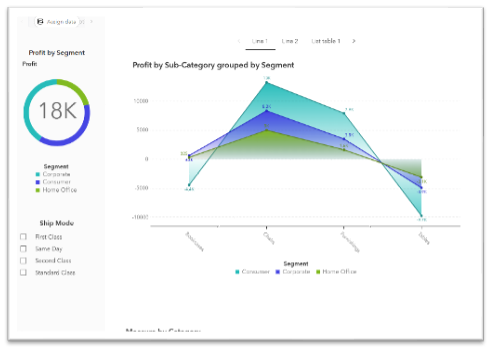
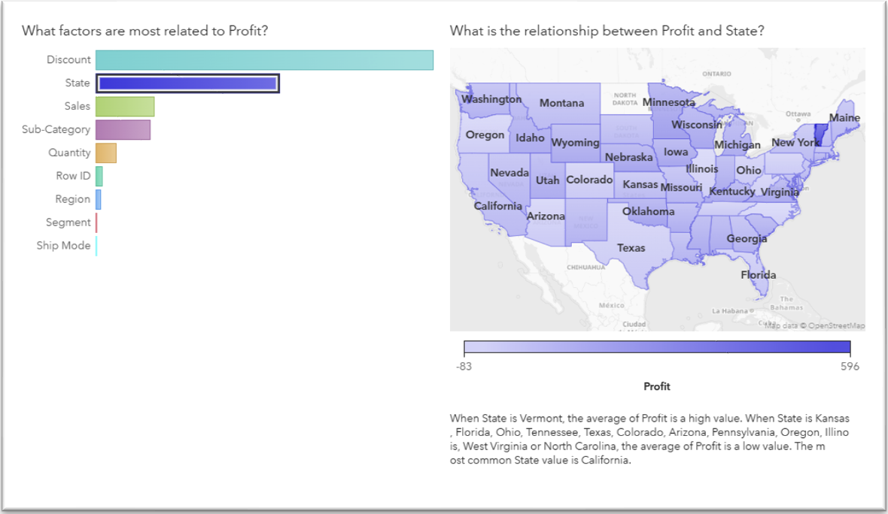
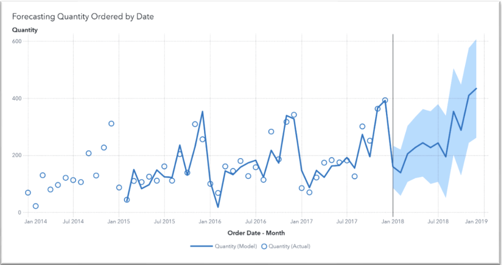

# Furniture Retail Profitability & Operations Analysis

## Overview
Analyzed **2,121 retail transactions** across **707 customers (2014–2017)** to identify key drivers of profitability, optimize pricing strategies, and improve operational decision-making.

---

## Business Problem
Retailers were experiencing **inconsistent profitability despite strong sales volume**.  

This project investigates how **discounting, product mix, and regional performance** impact margins and identifies opportunities to improve business outcomes.

---

## Tools & Technologies
- **SAS Viya** (data analysis, clustering, forecasting)
- **Excel** (data exploration)

---

## Key Insights

### 1. Discounting Erodes Profitability
- Strong negative correlation between **discount rate and profit**
- Discounts between **40–70% consistently resulted in losses**

**Insight:** Revenue growth strategies were sacrificing profitability

---

### 2. Product Mix Drives Margins
- **Chairs:** ~$26K profit (top performer)
- **Furnishings:** ~$13K profit
- **Tables:** ~$17K loss despite high sales volume

**Insight:** High sales ≠ high profit

---

### 3. Geographic Performance Gaps
- High-volume states (TX, OH, IL) underperforming
- Smaller markets (e.g., VT) delivering stronger margins

**Insight:** Regional strategy was not optimized

---

### 4. Customer Segment Volatility
- Consumer segment generated highest revenue (~$391K)
- Significant **profit instability**, including losses

**Insight:** High-value customers were not always high-profit

---

## Business Recommendations

- **Inventory Optimization:**  
  Reallocate investment from low-performing categories (Tables) to high-margin products (Chairs, Furnishings)

- **Discount Strategy Control:**  
  Implement discount caps (~30–40%) to prevent margin erosion

- **Regional Strategy Adjustment:**  
  Customize pricing and logistics strategies for underperforming regions

- **Demand Forecasting:**  
  Use predictive models to anticipate demand and improve inventory planning

---

## Visualizations
*(Add your images below once uploaded)*

---

## Business Impact
This analysis demonstrates how data can be leveraged to:
- Improve **pricing strategy**
- Optimize **inventory allocation**
- Identify **underperforming regions**
- Enable **data-driven operational decisions**

---

## 🔗 Project Takeaway
This project highlights my ability to translate data into actionable insights that drive business performance, particularly in **operations and business intelligence contexts**.
